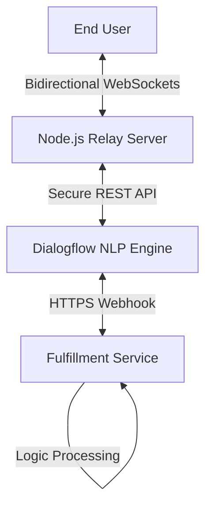

# SkyBot: AI-Powered Real-time Flight Assistant ✈️🤖

[](https://opensource.org/licenses/MIT)
[](https://reactjs.org/)
[](https://nodejs.org/)
[](https://cloud.google.com/dialogflow)

A sophisticated, event-driven chat application that bridges the gap between natural language processing and real-time user interfaces. SkyBot leverages Google's Dialogflow ES engine to provide a seamless flight booking experience through a custom WebSocket relay.

---

## 🚀 Key Highlights

- **🔌 Event-Driven Architecture:** Utilizing WebSockets for sub-second latency and persistent, low-overhead communication.
- **🎨 Premium UI/UX:** A high-fidelity, WhatsApp-inspired dark interface built with **React** and tailored CSS variables.
- **🛡️ Security-First Proxy:** All AI interactions are proxied through a Node.js relay server, ensuring Google Cloud credentials never touch the client-side.
- **🧩 Modular Backend:** Built using a **Service-Oriented Architecture (SOA)** with clear separation between transport (Controllers) and business logic (Services).
- **📝 Stateful Webhooks:** Optimized Dialogflow fulfillment logic that maintains context-aware parameters across complex conversational turns.

---

## 🏗️ System Architecture

SkyBot is built on a robust three-tier architecture designed for scalability and security:

1.  **Client Tier (React):** A sleek, reactive frontend that manages connection lifecycles and provides feedback with typing indicators and blue-check delivery receipts.
2.  **Relay Tier (Node.js/Express):** A custom WebSocket orchestration layer that handles high-concurrency requests and acts as a secure bridge to Google's NLP API.
3.  **Intelligence Tier (Dialogflow ES):** Uses advanced intent matching and entity extraction to parse traveler requirements (cities, passenger counts, cabin classes).



---

## 🛠️ Technical Stack

- **Frontend:** React, Vanilla CSS3 (Custom Variables), Plus Jakarta Sans.
- **Backend:** Node.js, Express.js, `ws` (WebSockets).
- **NLP & AI:** Google Cloud Dialogflow ES, Google Auth Library.
- **Infrastructure:** Docker, Docker Compose, Vite.

---

## 🚦 Getting Started

### Prerequisites
- Node.js (v18.0+)
- Google Cloud Platform Account (Dialogflow API enabled)
- A Service Account JSON key stored in `server/service-account.json`.

### 1. Installation
Clone the repository and install the dependencies:

```bash
# Backend Setup
cd server && npm install

# Frontend Setup
cd ../client && npm install
```

### 2. Configuration
Create a `.env` file in the `/server` directory:
```env
PORT=3001
DIALOGFLOW_PROJECT_ID=your-project-id
GOOGLE_APPLICATION_CREDENTIALS=service-account.json
```

### 3. Execution
Launch both services using the built-in development scripts:

```bash
# Terminal 1: Server
cd server && npm run dev

# Terminal 2: Client
cd client && npm run dev
```

---

## 🧠 Design Philosophy

- **Decoupling:** The logic for "how a message is sent" (WebSockets) is completely separate from "what a message means" (NLP logic).
- **Latency Optimization:** By using WebSockets instead of traditional polling or individual HTTP requests, we achieve a conversational flow that feels "alive."
- **User Trust:** Features like read receipts and typing animations are implemented to mirror the psychological comfort of modern IM apps like WhatsApp.

---

## � Future Roadmap
- [ ] Support for multiple conversation sessions via Redis labels.
- [ ] Integration with real-time flight search APIs (e.g., Amadeus or Skyscanner).
- [ ] Multi-language support using Dialogflow's localization features.

---

**Developed with ❤️ for high-performance AI interactions.**