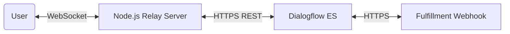

# Dialogflow Real-time Chat Application

A high-performance, real-time flight booking assistant built using **React**, **Node.js**, **WebSockets**, and **Google Dialogflow ES**.

## 🚀 Project Overview

This application demonstrates a seamless integration between a modern frontend and Google's Dialogflow ES engine via a custom WebSocket relay server. It is designed to handle complex conversational flows, specifically optimized for a flight booking use case.

### Key Features
- **Real-time Communication:** Persistent WebSocket connection for instant message delivery.
- **WhatsApp-Inspired UI:** Premium dark-themed interface with smooth animations and bold typography.
- **Dialogflow ES Integration:** Uses Google’s REST API for robust intent detection and natural language processing.
- **Clean Architecture:** Organized into Controllers, Services, and Repositories for scalability and maintainability.
- **Fulfillment Webhook:** Custom logic for parameter extraction and confirmation flows.

---

## 🏗️ Architecture Overview

The system follows a three-tier architecture to ensure separation of concerns:

1.  **Frontend (React):** Manages the UI/UX and maintains a persistent WebSocket connection to the relay server.
2.  **Relay Server (Node.js/Express):** Handles WebSocket lifecycles and acts as a gateway between the client and Google Cloud.
3.  **Dialogflow ES (NLP Engine):** Processes natural language, extracts entities (cities, passenger count, class), and triggers fulfillment.



---

## 🛠️ Tech Stack
- **Frontend:** React, Vanilla CSS (Plus Jakarta Sans)
- **Backend:** Node.js, Express, `ws` (WebSockets)
- **APIs:** Google Cloud Dialogflow ES API, Google Auth Library
- **Development Tools:** Vite, Nodemon, Ngrok

---

## 🚦 Getting Started

### Prerequisites
- Node.js (v18+)
- A Google Cloud Service Account JSON key with `Dialogflow API Client` permissions.

### 1. Installation
Clone the repository and install dependencies for both the client and server:

```bash
# Install root/server dependencies
cd server
npm install

# Install client dependencies
cd ../client
npm install
```

### 2. Environment Configuration
Create a `.env` file in the `/server` directory:

```env
PORT=3001
DIALOGFLOW_PROJECT_ID=your-project-id
GOOGLE_APPLICATION_CREDENTIALS=../chat-bot-service.json
```

### 3. Running the Project

**Start the Backend:**
```bash
cd server
npm run dev
```

**Start the Frontend:**
```bash
cd client
npm run dev
```

---

## ✈️ Flight Booking Flow
The assistant is trained to handle the following sequential flow:
1.  **Trigger:** "I need to book a flight."
2.  **Route:** User provides departure and destination cities.
3.  **Details:** Assistant asks for number of passengers and travel class.
4.  **Confirmation:** User confirms the summarized details ("Yes").
5.  **Success:** Bot confirms flight search initialization.

---

## 📄 Submission Requirements
As per **Evaluation Test 4**, this project includes:
- [x] Clean, well-organized code.
- [x] Architecture overview and key components.
- [x] Full end-to-end flight booking interaction.
- [x] README with setup instructions.